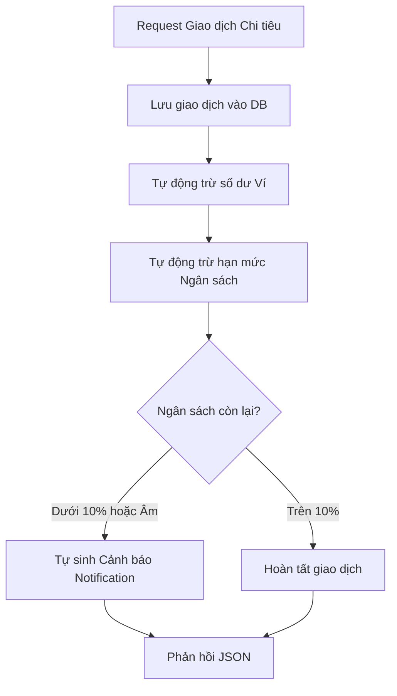

# Hệ Thống Web API Quản Lý Thu Chi (Backend Server)

Đây là đồ án kết thúc môn học **Kĩ thuật lập trình Python** tại UIT. Dự án được phát triển dưới dạng **Backend RESTful API Server** (không sử dụng Template giao diện, trả về dữ liệu JSON thuần phục vụ kiểm thử trên Postman). Hệ thống áp dụng chặt chẽ tư duy Lập trình hướng đối tượng (OOP), kiến trúc Model-View-Template (MVT) cải tiến của Django và các chuẩn bảo mật hiện đại.

---

## 🛠️ Công Nghệ Sử Dụng

- **Ngôn ngữ chính:** Python 3.12+
- **Framework:** Django 6.0.5
- **Công cụ API:** Django REST Framework (DRF) 3.17.1
- **Cơ chế xác thực:** JSON Web Token (JWT) qua `djangorestframework-simplejwt`
- **Tài liệu API:** Swagger UI qua `drf-yasg` (truy cập tại `/swagger/`)
- **Cơ sở dữ liệu:** SQLite (Lưu trữ tệp cục bộ phục vụ demo gọn nhẹ)

---

## 🌟 Tính Năng Đặc Biệt Nhất: Xử Lý Giao Dịch Liên Hoàn & Cảnh Báo Ngân Sách Tự Động

Chức năng tâm đắc nhất của hệ thống: khi tạo 1 giao dịch chi tiêu, hệ thống tự động kích hoạt chuỗi xử lý liên hoàn — trừ ví, trừ ngân sách, sinh cảnh báo. Khi xóa giao dịch, toàn bộ được hoàn tác ngược lại.

### Cơ chế hoạt động:



### Điểm nhấn kỹ thuật:
- **Tính đóng gói:** Toàn bộ logic trừ ví, bù trừ ngân sách nằm gọn trong `perform_create`, `perform_update`, `perform_destroy` của `TransactionViewSet`.
- **Tự hồi phục:** Khi sửa hoặc xóa giao dịch, hệ thống tự tính chênh lệch và hoàn tiền ví + ngân sách.

---

## 🚀 Hướng Dẫn Cài Đặt và Khởi Chạy

### Bước 1: Kích hoạt môi trường ảo
```bash
# MacOS/Linux
source venv/bin/activate

# Windows
.\venv\Scripts\activate
```

### Bước 2: Cài đặt thư viện
```bash
pip install -r requirements.txt
```

### Bước 3: Khởi tạo cơ sở dữ liệu
```bash
python manage.py makemigrations
python manage.py migrate
```

### Bước 4: Tạo tài khoản Admin
```bash
DJANGO_SUPERUSER_PASSWORD=admin123456 python manage.py createsuperuser --username admin --email admin@uit.edu.vn --noinput
```

### Bước 5: Khởi chạy Server
```bash
python manage.py runserver
```
Server chạy tại: `http://127.0.0.1:8000/`

---

## 📋 Danh Sách 39 API Endpoints (`api/v1/`)

### 1. Tài khoản & Xác thực (`users`) — 9 APIs

| STT | Phương thức | API Endpoint | Chức năng | Phân quyền |
|:---:|:---:|---|---|---|
| 1 | `POST` | `/api/v1/users/register/` | Đăng ký tài khoản mới | Tự do |
| 2 | `POST` | `/api/v1/users/login/` | Đăng nhập (Lấy JWT Token) | Tự do |
| 3 | `GET` | `/api/v1/users/profile/` | Xem thông tin cá nhân | Đã đăng nhập |
| 4 | `PUT` | `/api/v1/users/profile/` | Cập nhật thông tin cá nhân | Đã đăng nhập |
| 5 | `GET` | `/api/v1/users/admin/` | Admin: Danh sách tài khoản | Chỉ Admin |
| 6 | `POST` | `/api/v1/users/admin/` | Admin: Tạo tài khoản | Chỉ Admin |
| 7 | `GET` | `/api/v1/users/admin/{id}/` | Admin: Xem chi tiết tài khoản | Chỉ Admin |
| 8 | `PUT` | `/api/v1/users/admin/{id}/` | Admin: Sửa tài khoản | Chỉ Admin |
| 9 | `DELETE` | `/api/v1/users/admin/{id}/` | Admin: Xóa tài khoản | Chỉ Admin |

### 2. Danh mục (`categories`) — 5 APIs

| STT | Phương thức | API Endpoint | Chức năng | Phân quyền |
|:---:|:---:|---|---|---|
| 10 | `GET` | `/api/v1/categories/` | Danh sách danh mục (cây đệ quy) | Đã đăng nhập |
| 11 | `POST` | `/api/v1/categories/` | Tạo danh mục mới | Đã đăng nhập |
| 12 | `GET` | `/api/v1/categories/{id}/` | Xem chi tiết danh mục | Đã đăng nhập |
| 13 | `PUT` | `/api/v1/categories/{id}/` | Sửa danh mục | Chỉ Admin |
| 14 | `DELETE` | `/api/v1/categories/{id}/` | Xóa danh mục | Chỉ Admin |

### 3. Ví tiền (`wallets`) — 5 APIs

| STT | Phương thức | API Endpoint | Chức năng | Phân quyền |
|:---:|:---:|---|---|---|
| 15 | `GET` | `/api/v1/wallets/` | Danh sách ví tiền | Đã đăng nhập |
| 16 | `POST` | `/api/v1/wallets/` | Tạo ví mới | Đã đăng nhập |
| 17 | `GET` | `/api/v1/wallets/{id}/` | Xem chi tiết ví | Đã đăng nhập |
| 18 | `PUT` | `/api/v1/wallets/{id}/` | Sửa thông tin ví | Đã đăng nhập |
| 19 | `DELETE` | `/api/v1/wallets/{id}/` | Xóa ví | Đã đăng nhập |

### 4. Giao dịch (`transactions`) — 10 APIs

| STT | Phương thức | API Endpoint | Chức năng | Phân quyền |
|:---:|:---:|---|---|---|
| 20 | `GET` | `/api/v1/transactions/` | Lịch sử giao dịch | Đã đăng nhập |
| 21 | `POST` | `/api/v1/transactions/` | Tạo giao dịch (auto trừ ví, ngân sách, cảnh báo) | Đã đăng nhập |
| 22 | `GET` | `/api/v1/transactions/{id}/` | Xem chi tiết giao dịch | Đã đăng nhập |
| 23 | `PUT` | `/api/v1/transactions/{id}/` | Sửa giao dịch (auto bù trừ chênh lệch) | Đã đăng nhập |
| 24 | `DELETE` | `/api/v1/transactions/{id}/` | Xóa giao dịch (auto hoàn ví & ngân sách) | Đã đăng nhập |
| 25 | `POST` | `/api/v1/transactions/transfer/` | Chuyển khoản nội bộ giữa 2 ví | Đã đăng nhập |
| 26 | `GET` | `/api/v1/transactions/reports/summary/` | Thống kê tổng thu chi tháng | Đã đăng nhập |
| 27 | `GET` | `/api/v1/transactions/reports/categories/` | Thống kê % theo danh mục | Đã đăng nhập |
| 28 | `GET` | `/api/v1/transactions/reports/daily/` | Thống kê dòng tiền theo ngày | Đã đăng nhập |

### 5. Ngân sách (`budgets`) — 5 APIs

| STT | Phương thức | API Endpoint | Chức năng | Phân quyền |
|:---:|:---:|---|---|---|
| 29 | `GET` | `/api/v1/budgets/` | Danh sách ngân sách | Đã đăng nhập |
| 30 | `POST` | `/api/v1/budgets/` | Tạo ngân sách (tự gán remain = amount) | Đã đăng nhập |
| 31 | `GET` | `/api/v1/budgets/{id}/` | Xem chi tiết ngân sách | Đã đăng nhập |
| 32 | `PUT` | `/api/v1/budgets/{id}/` | Sửa ngân sách | Đã đăng nhập |
| 33 | `DELETE` | `/api/v1/budgets/{id}/` | Xóa ngân sách | Đã đăng nhập |

### 6. Cảnh báo (`notifications`) — 4 APIs

| STT | Phương thức | API Endpoint | Chức năng | Phân quyền |
|:---:|:---:|---|---|---|
| 34 | `GET` | `/api/v1/notifications/` | Danh sách cảnh báo ngân sách | Đã đăng nhập |
| 35 | `GET` | `/api/v1/notifications/{id}/` | Xem chi tiết cảnh báo | Đã đăng nhập |
| 36 | `POST` | `/api/v1/notifications/{id}/mark_read/` | Đánh dấu đã đọc 1 thông báo | Đã đăng nhập |
| 37 | `POST` | `/api/v1/notifications/mark_all_read/` | Đánh dấu tất cả đã đọc | Đã đăng nhập |

### 7. Báo cáo & Phân tích OOP — 2 APIs

| STT | Phương thức | API Endpoint | Chức năng | Module OOP |
|:---:|:---:|---|---|---|
| 38 | `GET` | `/api/v1/transactions/reports/analysis/` | Phân tích chi tiêu theo 3 góc nhìn (đa hình) | `phan_tich_chi_tieu.py` |
| 39 | `GET` | `/api/v1/transactions/reports/export/?format=json\|csv\|text` | Xuất báo cáo đa định dạng (đa hình) | `xuat_bao_cao.py` |

---

## 🧩 Module OOP Tự Xây Dựng

### Module 1: `expenses/phan_tich_chi_tieu.py` — Phân Tích Chi Tiêu

```
ABCPhanTich (ABC)              ← Lớp trừu tượng gốc, @abstractmethod phan_tich()
  ├── PhanTichTheoNgay          ← Override: tổng thu/chi theo từng ngày
  ├── PhanTichTheoDanhMuc       ← Override: tỷ lệ % chi tiêu theo danh mục
  └── PhanTichTheoVi            ← Override: thu/chi/số giao dịch theo từng ví

BaoCaoTaiChinh                 ← Lớp quản lý: gọi đa hình qua map()
```

### Module 2: `expenses/xuat_bao_cao.py` — Xuất Báo Cáo

```
ABCXuatBaoCao (ABC)            ← Lớp trừu tượng gốc, @abstractmethod xuat()
  ├── XuatJSON                  ← Override: xuất chuỗi JSON có thụt dòng
  ├── XuatCSV                   ← Override: xuất CSV có header
  └── XuatText                  ← Override: xuất bảng văn bản có đường kẻ

QuanLyXuatBaoCao               ← Lớp quản lý: gọi đa hình qua map()
```

Chạy độc lập:
```bash
python3 expenses/phan_tich_chi_tieu.py
python3 expenses/xuat_bao_cao.py
```

---

## 🎯 Kịch Bản Kiểm Thử 16 Bước Liên Hoàn (Postman Collection)

Tệp: **`quan_ly_thu_chi_postman_collection.json`**

### Cách chạy:

1. **Reset DB** (nếu cần chạy lại từ đầu):
```bash
python manage.py flush --no-input
DJANGO_SUPERUSER_PASSWORD=admin123456 python manage.py createsuperuser --username admin --email admin@uit.edu.vn --noinput
python manage.py runserver
```
2. Mở **Postman** → Import file → Bấm **Run Collection**

### Cơ chế tự động hóa biến:
Collection tích hợp JavaScript Script tự động lưu Token, UUID ví, UUID giao dịch vào biến môi trường — không cần copy/paste thủ công.

### 16 bước nghiệp vụ:

| Bước | Hành vi | Điểm nhấn |
|:---:|---|---|
| 01 | Đăng ký tài khoản | Mã hóa PBKDF2 |
| 02 | Đăng nhập lấy Token | Auto-save JWT |
| 03 | Tạo ví Techcombank (5tr) | Auto-save wallet_a_id |
| 04 | Tạo ví Momo (1tr) | Auto-save wallet_b_id |
| 05 | Tạo danh mục chi "Ăn uống" | Auto-save category_id |
| 06 | Tạo danh mục thu "Lương" | Auto-save income_category_id |
| 07 | Đặt ngân sách 1tr/tháng | Auto-save budget_id |
| 08 | Nhận lương 2tr | Auto cộng ví |
| 09 | Chi ăn uống 950k | Auto trừ ví + trừ ngân sách + sinh cảnh báo |
| 10 | Chuyển khoản A→B 500k | 2 bản ghi đối sánh |
| 11 | Kiểm tra cảnh báo | Auto-save notification_id |
| 12 | Thống kê tổng thu chi | Thu 2tr, Chi 950k |
| 13 | Thống kê % theo danh mục | Data biểu đồ tròn |
| 14 | Thống kê theo ngày | Data biểu đồ cột |
| 15 | Phân tích chi tiêu OOP | Module phan_tich_chi_tieu.py |
| 16 | Xuất báo cáo OOP | Module xuat_bao_cao.py |
