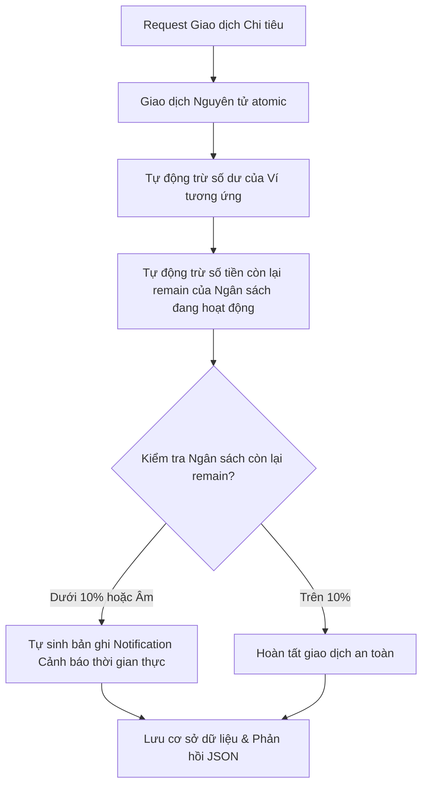

# Hệ Thống Web API Quản Lý Thu Chi (Backend Server)

Đây là đồ án kết thúc môn học **Kĩ thuật lập trình Python** tại UIT. Dự án được phát triển dưới dạng **Backend RESTful API Server** (không sử dụng Template giao diện, trả về dữ liệu JSON thuần phục vụ kiểm thử trên Postman). Hệ thống áp dụng chặt chẽ tư duy Lập trình hướng đối tượng (OOP), kiến trúc Model-View-Template (MVT) cải tiến của Django và các chuẩn bảo mật hiện đại.

---

## 🛠️ Công Nghệ Sử Dụng

- **Ngôn ngữ chính:** Python 3.12+
- **Framework:** Django 6.0.5
- **Công cụ API:** Django REST Framework (DRF) 3.17.1
- **Cơ chế xác thực:** JSON Web Token (JWT) qua `djangorestframework-simplejwt`
- **Cơ sở dữ liệu:** SQLite (Lưu trữ tệp cục bộ phục vụ demo gọn nhẹ)

---

## 🌟 Tính Năng Đặc Biệt Nhất: Giao Dịch Nguyên Tử & Tự Động Hóa Cảnh Báo An Toàn Ngân Sách

Chức năng tâm đắc nhất và có độ phức tạp kỹ thuật cao nhất của hệ thống chính là **"Xử lý logic giao dịch nguyên tử ngầm và Tự động hóa cảnh báo an toàn ngân sách"**. Đây là điểm nhấn cốt lõi thể hiện rõ tư duy lập trình hướng đối tượng (OOP) nâng cao và khả năng làm chủ luồng dữ liệu chặt chẽ của Python/Django.

### 1. Cơ chế hoạt động ngầm (Under the hood):
Khi một request thay đổi giao dịch chi tiêu được gửi lên, hệ thống không chỉ ghi nhận bản ghi mà còn tự động kích hoạt một chuỗi các nghiệp vụ liên hoàn:



### 2. Sự tinh tế trong Thiết kế OOP & Framework Engineering:
- **Giao dịch Nguyên tử (`@db_transaction.atomic`):** Đảm bảo tính toàn vẹn dữ liệu tuyệt đối (Data Integrity). Nếu bất kỳ bước nào trong chuỗi tính toán trên bị lỗi (ví dụ: ví bị thiếu tiền hoặc lỗi mạng), toàn bộ quá trình sẽ bị đảo ngược (Rollback) hoàn toàn, loại bỏ 100% rủi ro sai lệch số dư.
- **Tính đóng gói chặt chẽ:** Toàn bộ logic cập nhật số dư, bù trừ chênh lệch ngân sách được đóng gói trực tiếp bên trong các phương thức kế thừa của bộ kiểm soát View (`perform_create`, `perform_update`, `perform_destroy` trong `TransactionViewSet`), che giấu hoàn toàn sự phức tạp khỏi phía Client.
- **Khả năng tự hồi phục thông minh:** Khi sửa hoặc xóa giao dịch, hệ thống tự động hoàn lại tiền vào ví nguồn và khôi phục hạn mức ngân sách y hệt trạng thái ban đầu một cách hoàn toàn tự động.

---


## 🚀 Hướng Dẫn Cài Đặt và Khởi Chạy Dự Án

### Bước 1: Kích hoạt môi trường ảo (Virtual Environment)
Mở Terminal ngay tại thư mục chứa đồ án `doan/` và thực hiện:

```bash
# Trên MacOS/Linux
source venv/bin/activate

# Hoặc trên Windows
.\venv\Scripts\activate
```

### Bước 2: Di chuyển vào thư mục dự án và cài đặt thư viện
```bash
cd quan_ly_thu_chi
pip install -r requirements.txt
```

### Bước 3: Đồng bộ và Khởi tạo Cơ sở dữ liệu (Database Migrations)
```bash
python manage.py makemigrations
python manage.py migrate
```

### Bước 4: Tạo tài khoản Admin hệ thống (Superuser)
Tài khoản này dùng để truy cập vào trang Admin `/admin/` và sử dụng các API dành riêng cho Quản trị viên:
```bash
python manage.py createsuperuser
```
*Nhập thông tin: Username, Email, Mật khẩu theo yêu cầu trên màn hình Terminal.*

### Bước 5: Khởi chạy Backend Server
```bash
python manage.py runserver
```
Server sẽ chạy mặc định tại địa chỉ: `http://127.0.0.1:8000/`

---

## 📋 Danh Sách Chi Tiết 37 API Endpoints Hệ Thống (`api/v1/`)

Để bạn dễ dàng kiểm đếm và đối chiếu trực tiếp trên Postman, dưới đây là danh sách chi tiết được phân rã đầy đủ từng phương thức HTTP (chỉ bao gồm GET, POST, PUT, DELETE; đã loại bỏ hoàn toàn PATCH). Hệ thống có tổng cộng **37 API Endpoints**:

### 1. Phân hệ Tài khoản & Xác thực (`users`) - 9 APIs

| STT | Phương thức | API Endpoint | Chức năng chi tiết | Phân quyền |
|:---:|:---:|---|---|---|
| **1** | `POST` | `/api/v1/users/register/` | Đăng ký tài khoản mới (Mã hóa mật khẩu) | Tự do |
| **2** | `POST` | `/api/v1/users/login/` | Đăng nhập hệ thống (Lấy Access & Refresh Token) | Tự do |
| **3** | `GET` | `/api/v1/users/profile/` | Xem thông tin cá nhân của User đang đăng nhập | Đã đăng nhập |
| **4** | `PUT` | `/api/v1/users/profile/` | Cập nhật toàn bộ thông tin cá nhân | Đã đăng nhập |
| **5** | `GET` | `/api/v1/users/admin/` | Admin: Danh sách tất cả tài khoản trong hệ thống | Chỉ Admin |
| **6** | `POST` | `/api/v1/users/admin/` | Admin: Tạo tài khoản mới trực tiếp | Chỉ Admin |
| **7** | `GET` | `/api/v1/users/admin/{id}/` | Admin: Xem thông tin chi tiết tài khoản bất kỳ | Chỉ Admin |
| **8** | `PUT` | `/api/v1/users/admin/{id}/` | Admin: Cập nhật toàn bộ thông tin tài khoản | Chỉ Admin |
| **9** | `DELETE` | `/api/v1/users/admin/{id}/` | Admin: Xóa vĩnh viễn tài khoản khỏi hệ thống | Chỉ Admin |

### 2. Phân hệ Quản lý Giao dịch & Cảnh báo tài chính (`expenses`) - 28 APIs

#### 2.1. Phân hệ Danh mục chi tiêu (Category) - 5 APIs
| STT | Phương thức | API Endpoint | Chức năng chi tiết | Phân quyền |
|:---:|:---:|---|---|---|
| **10** | `GET` | `/api/v1/categories/` | Lấy danh sách danh mục (Tự lồng cây con đệ quy) | Đã đăng nhập |
| **11** | `POST` | `/api/v1/categories/` | Tạo danh mục chi tiêu mới | Đã đăng nhập |
| **12** | `GET` | `/api/v1/categories/{id}/` | Xem thông tin chi tiết của danh mục | Đã đăng nhập |
| **13** | `PUT` | `/api/v1/categories/{id}/` | Sửa toàn bộ thông tin danh mục | Chỉ Admin |
| **14** | `DELETE` | `/api/v1/categories/{id}/` | Xóa danh mục khỏi hệ thống | Chỉ Admin |

#### 2.2. Phân hệ Ví cá nhân (Wallet) - 5 APIs
| STT | Phương thức | API Endpoint | Chức năng chi tiết | Phân quyền |
|:---:|:---:|---|---|---|
| **15** | `GET` | `/api/v1/wallets/` | Xem danh sách các Ví tiền cá nhân | Đã đăng nhập |
| **16** | `POST` | `/api/v1/wallets/` | Tạo Ví tiền mới | Đã đăng nhập |
| **17** | `GET` | `/api/v1/wallets/{id}/` | Xem chi tiết số dư và thông tin Ví | Đã đăng nhập |
| **18** | `PUT` | `/api/v1/wallets/{id}/` | Cập nhật thông tin Ví | Đã đăng nhập |
| **19** | `DELETE` | `/api/v1/wallets/{id}/` | Xóa Ví tiền cá nhân | Đã đăng nhập |

#### 2.3. Phân hệ Giao dịch Thu/Chi (Transaction) - 9 APIs
| STT | Phương thức | API Endpoint | Chức năng chi tiết | Phân quyền |
|:---:|:---:|---|---|---|
| **20** | `GET` | `/api/v1/transactions/` | Xem danh sách lịch sử giao dịch Thu/Chi | Đã đăng nhập |
| **21** | `POST` | `/api/v1/transactions/` | Tạo giao dịch (**Auto trừ ví, trừ ngân sách, cảnh báo**) | Đã đăng nhập |
| **22** | `GET` | `/api/v1/transactions/{id}/` | Xem chi tiết bản ghi giao dịch | Đã đăng nhập |
| **23** | `PUT` | `/api/v1/transactions/{id}/` | Sửa giao dịch (**Auto bù trừ chênh lệch số dư**) | Đã đăng nhập |
| **24** | `DELETE` | `/api/v1/transactions/{id}/` | Xóa giao dịch (**Auto hoàn trả ví & ngân sách**) | Đã đăng nhập |
| **25** | `POST` | `/api/v1/transactions/transfer/` | **Chuyển khoản nội bộ giữa 2 Ví** | Đã đăng nhập |
| **26** | `GET` | `/api/v1/transactions/reports/summary/` | **Báo cáo: Tổng Thu, Tổng Chi, Số dư ròng tháng** | Đã đăng nhập |
| **27** | `GET` | `/api/v1/transactions/reports/categories/` | **Báo cáo: % chi tiêu theo danh mục (Biểu đồ tròn)** | Đã đăng nhập |
| **28** | `GET` | `/api/v1/transactions/reports/daily/` | **Báo cáo: Biến động dòng tiền theo ngày (Biểu đồ cột)** | Đã đăng nhập |

#### 2.4. Phân hệ Hạn mức Ngân sách (Budget) - 5 APIs
| STT | Phương thức | API Endpoint | Chức năng chi tiết | Phân quyền |
|:---:|:---:|---|---|---|
| **29** | `GET` | `/api/v1/budgets/` | Xem danh sách ngân sách đang hoạt động | Đã đăng nhập |
| **30** | `POST` | `/api/v1/budgets/` | Thiết lập ngân sách mới (Tự gán `remain = amount`) | Đã đăng nhập |
| **31** | `GET` | `/api/v1/budgets/{id}/` | Xem chi tiết cấu hình ngân sách | Đã đăng nhập |
| **32** | `PUT` | `/api/v1/budgets/{id}/` | Cập nhật ngân sách | Đã đăng nhập |
| **33** | `DELETE` | `/api/v1/budgets/{id}/` | Xóa ngân sách | Đã đăng nhập |

#### 2.5. Phân hệ Cảnh báo tài chính (Notification) - 4 APIs
| STT | Phương thức | API Endpoint | Chức năng chi tiết | Phân quyền |
|:---:|:---:|---|---|---|
| **34** | `GET` | `/api/v1/notifications/` | Xem danh sách các cảnh báo an toàn ngân sách | Đã đăng nhập |
| **35** | `GET` | `/api/v1/notifications/{id}/` | Xem chi tiết một cảnh báo | Đã đăng nhập |
| **36** | `POST` | `/api/v1/notifications/{id}/mark_read/` | Đánh dấu thông báo cụ thể là đã đọc | Đã đăng nhập |
| **37** | `POST` | `/api/v1/notifications/mark_all_read/` | Đánh dấu tất cả thông báo của user là đã đọc | Đã đăng nhập |

---

## 🎯 Kịch Bản Demo Test Tự Động Hóa Qua Postman Collection

Để giúp buổi thuyết trình đồ án diễn ra trơn tru nhất và gây ấn tượng mạnh với giảng viên, hệ thống đã đi kèm một tệp **Postman Collection tích hợp kịch bản kiểm thử tự động 100%**:

Tệp cấu hình: **[quan_ly_thu_chi_postman_collection.json](file:///Users/dang/Documents/UIT/python312/doan/quan_ly_thu_chi/quan_ly_thu_chi_postman_collection.json)**

---

### 📥 Bước 1: Nhập Collection vào Postman
1. Mở ứng dụng **Postman** trên máy tính.
2. Nhấn nút **Import** ở góc trên cùng bên trái màn hình.
3. Chọn tệp `quan_ly_thu_chi_postman_collection.json` nằm tại thư mục gốc của đồ án để tải lên.
4. Thư mục **"UIT - Đồ án Quản lý Thu Chi Backend API"** sẽ xuất hiện trong danh sách Collections của bạn với đầy đủ **13 request** được đánh số thứ tự tuần tự.

---

### ⚙️ Bước 2: Cơ chế Tự động hóa Biến số (Auto-Variables Script)
Collection này đã được tích hợp mã Script JavaScript trong tab **Tests** của Postman. Khi bạn chạy tuần tự từ trên xuống dưới, hệ thống sẽ **tự động bắt lấy các ID dạng UUID và Token xác thực** từ phản hồi JSON rồi truyền trực tiếp cho các request tiếp theo. Bạn **hoàn toàn không cần copy/paste thủ công** bất kỳ thông tin nào!

Các biến số tự động bao gồm:
- `base_url`: Địa chỉ server mặc định là `http://127.0.0.1:8000`.
- `access_token`: Token JWT của tài khoản, tự động cập nhật sau khi chạy xong request Đăng nhập.
- `wallet_a_id` / `wallet_b_id`: ID tự sinh của Ví ATM Techcombank và Ví Momo.
- `category_id`: ID tự sinh của danh mục "Ăn uống hàng ngày".
- `budget_id`: ID tự sinh của Ngân sách tháng.
- `transaction_id`: ID tự sinh của giao dịch ăn uống 950.000 đ.

---

### 🏃‍♂️ Bước 3: Thực hiện Kịch Bản Demo 13 Bước

Hãy nhấp chuột và gửi (**Send**) từng request theo đúng thứ tự đánh số:

1. **`01. Đăng ký tài khoản`**: 
   - Đăng ký tài khoản cá nhân hóa cho sinh viên:
     * *Username:* `leminhdang`
     * *Email:* `leminhdang@uit.edu.vn`
     * *Password:* `123123123a`
     * *Name:* `Lê Minh Đăng`
   - *Logic OOP:* Mật khẩu được mã hóa an toàn bằng thuật toán băm PBKDF2 của Django.

2. **`02. Đăng nhập hệ thống (Auto Token)`**:
   - Sử dụng Email đăng nhập để nhận Token JWT. Postman Script sẽ tự động chụp lấy Access Token và lưu làm khóa xác thực Bearer Token cho các API tiếp theo.

3. **`03. Tạo Ví Techcombank (Ví A)`**:
   - Khởi tạo ví ATM Techcombank có số dư **5.000.000 đ**. ID của ví tự động được lưu vào biến `wallet_a_id`.

4. **`04. Tạo Ví Momo (Ví B)`**:
   - Khởi tạo ví Momo Tiết kiệm có số dư **1.000.000 đ**. ID của ví tự động được lưu vào biến `wallet_b_id`.

5. **`05. Tạo Danh mục chi ăn uống`**:
   - Tạo danh mục "Ăn uống hàng ngày" thuộc loại Chi tiêu (`expense`). ID danh mục tự động lưu vào biến `category_id`.

6. **`06. Thiết lập Ngân sách hạn mức`**:
   - Tạo hạn mức ngân sách ăn uống tối đa **1.000.000 đ** áp dụng cho `Ví A` (Techcombank). Hệ thống tự khởi tạo số dư còn lại `remain = 1.000.000đ`.

7. **`07. Ghi nhận giao dịch chi tiêu (Auto trừ ví & trừ ngân sách)`**:
   - Tạo một giao dịch ăn uống buffet UIT trị giá **950.000 đ** từ `Ví A`.
   - *Logic tự động hóa ngầm cực kỳ ấn tượng:*
     - Số dư `Ví A` tự động giảm còn **4.050.000 đ**.
     - Số dư ngân sách `remain` tự trừ còn **50.000 đ** (dưới 10% hạn mức ban đầu).
     - Hệ thống phát hiện ngân sách sắp cạn kiệt $\rightarrow$ Tự động sinh ra 1 cảnh báo tài chính trong bảng `Notification` lưu vào cơ sở dữ liệu.

8. **`08. Chuyển khoản nội bộ (Ví A -> Ví B)`**:
   - Gửi yêu cầu chuyển khoản **500.000 đ** từ `Ví A` (Techcombank) sang `Ví B` (Momo).
   - *Sức mạnh xử lý giao dịch nguyên tử:* `Ví A` trừ 500k (còn 3.550.000đ), `Ví B` được cộng 500k (lên 1.500.000đ). Hệ thống tự sinh 2 giao dịch lịch sử (1 thu, 1 chi) để đối chiếu lịch sử rõ ràng.

9. **`09. Kiểm tra danh sách Cảnh báo`**:
   - API `GET /api/v1/notifications/` trả về thông báo cảnh báo vượt hạn mức ngân sách đã tự động phát sinh từ Bước 7.

10. **`10. Thống kê dòng tiền Thu vs Chi trong tháng`**:
    - Trả về JSON tổng kết dòng tiền Thu, Chi và số dư ròng trong tháng hiện tại của người dùng.

11. **`11. Thống kê Tỷ lệ % chi tiêu theo Danh mục`**:
    - Trả về tỉ lệ phần trăm chi tiêu phân bổ theo danh mục (Sẵn sàng phục vụ vẽ Biểu đồ tròn trên Client).

12. **`12. Thống kê Dòng tiền biến động theo Ngày`**:
    - Trả về số liệu Thu vs Chi theo từng ngày để phục vụ vẽ Biểu đồ cột dòng tiền.

13. **`13. Xóa Giao dịch (Tự hoàn trả ví & ngân sách)`**:
    - Xóa giao dịch ăn uống buffet trị giá 950.000 đ ở Bước 7 để chứng minh hệ thống tự động hoàn lại tiền cho ví Techcombank (tăng lên **4.500.000 đ**) và hồi phục số dư ngân sách `remain` lại **1.000.000 đ** nguyên vẹn ban đầu.

